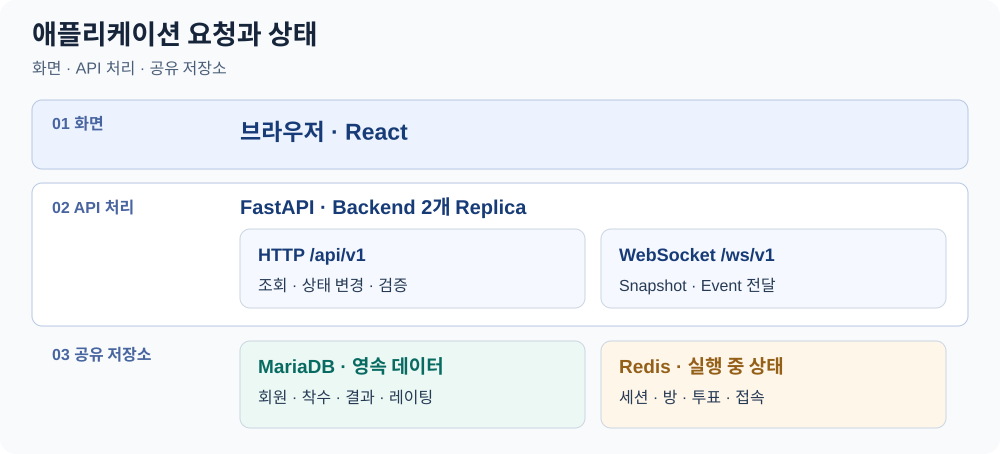

# seokpan-app

**「石나가는 판단(Seokpan)」의 실시간 투표형 오목 게임 서비스 — Frontend/Backend 애플리케이션 소스 저장소입니다.** Application Domain, HTTP/WebSocket API, MariaDB/Redis Adapter, Container 및 CI/CD 연계를 관리합니다.

Kubernetes 배포 상태는 [`seokpan-gitops`](https://github.com/seokpan/seokpan-gitops), 서버/네트워크/K8s 부트스트랩은 [`seokpan-infra`](https://github.com/seokpan/seokpan-infra), 설계 문서는 [`seokpan-docs`](https://github.com/seokpan/seokpan-docs)에서 관리합니다.

## 애플리케이션 개요

MariaDB를 **영속 데이터의 기준 저장소**로, Redis를 **Runtime State 저장소**로 분리해서 사용합니다.



브라우저의 상태 변경은 HTTP API로 처리하고, WebSocket은 Snapshot과 Event 전달에 사용합니다. Backend Replica는 공통 MariaDB·Redis Provider를 사용합니다. [Provider 조립 코드](backend/src/seokpan/production.py)와 아래 API·상태별 문서에서 세부 처리 규칙을 확인할 수 있습니다.

| State | Owner | 관련 문서 |
|---|---|---|
| Member Identity | MariaDB | [member-identity.md](backend/docs/member-identity.md) |
| Game / Move / Result | MariaDB | [game-persistence.md](backend/docs/game-persistence.md) |
| Schema / Migration | MariaDB (Alembic) | [mariadb-baseline.md](backend/docs/mariadb-baseline.md) |
| Session | Redis | [redis-session.md](backend/docs/redis-session.md) |
| Room Runtime | Redis | [redis-room-runtime.md](backend/docs/redis-room-runtime.md) |
| Current Vote / Resolver | Redis | [redis-vote-runtime.md](backend/docs/redis-vote-runtime.md) |

## 핵심 기술과 적용

| 영역 | 기술 | 이 저장소에서의 적용 |
|---|---|---|
| 화면 | React · TypeScript · Vite | [로비·방·게임 화면](frontend/src)과 실시간 상태 표시 |
| API·도메인 | Python · FastAPI | [HTTP/WebSocket API](backend/src/seokpan/api) 및 게임·투표 처리 |
| 데이터 | SQLAlchemy · Alembic · MariaDB · Redis | [영속 데이터](backend/src/seokpan/persistence/mariadb)와 [공유 실행 상태](backend/src/seokpan/persistence/redis)를 분리 |
| 이미지 검증 | Jenkins · Harbor | [테스트·빌드·스캔과 이미지 Digest 확정](Jenkinsfile.image-pipeline) |

## 저장소 구조

```text
seokpan-app/
├── backend/            # FastAPI (CPython 3.13, SQLAlchemy, Alembic, asyncmy, redis-py)
│   ├── src/ · tests/ · migrations/ · scripts/ · docs/
│   ├── Dockerfile · alembic.ini · pyproject.toml
│   └── README.md       # Backend 실행/개발 방법
├── frontend/           # React + TypeScript + Vite, Nginx
│   ├── src/
│   ├── Dockerfile · nginx.conf · package.json
│   └── README.md       # Frontend 실행/개발 방법
├── docs/               # 구현 기준 / CI·이미지 검증
│   ├── mvp-implementation-baseline.md
│   ├── ci-verification.md
│   └── a09-image-acceptance.md
├── Jenkinsfile                    # Application CI
└── Jenkinsfile.image-pipeline     # 이미지 빌드/스캔/Digest 증적
```

실행·개발 환경 설정은 각 하위 [`backend/README.md`](backend/README.md), [`frontend/README.md`](frontend/README.md)를 그대로 따릅니다.

## API 경계

| 구분 | Prefix | 역할 | 관련 문서 |
|---|---|---|---|
| HTTP | `/api/v1` | 상태 변경/조회 (Session, Room, Game, Vote) | [lobby-room-http.md](backend/docs/lobby-room-http.md) |
| WebSocket | `/ws/v1` | Snapshot·Event 실시간 전달 (`lobby`, `rooms/{room_id}`) | [lobby-room-websocket.md](backend/docs/lobby-room-websocket.md) |
| Turn 처리 | - | Vote 확정 → Move/Pass → Result | [turn-resolution-runner.md](backend/docs/turn-resolution-runner.md) |

HTTP 상태 변경 요청은 Session Cookie/Origin 검증/CSRF Token/`request_id`/`expected_state_version`으로 재처리·오래된 상태를 구분합니다. WebSocket은 조회·알림 전용이며 상태 변경 RPC로 사용하지 않습니다.

## 구현 진행 단계

```text
A-01 MVP Baseline → A-02 Scaffold → A-03 Pure Domain → A-04 MariaDB
→ A-05 Redis → A-06 HTTP/WebSocket → A-07 Headless First Success
→ A-08 Frontend First Success → A-09 Container/Jenkins → A-10 Provider/GitOps Integration
```

현재 `main`은 **A-10(Provider/GitOps Integration)까지 반영**된 상태이며, `Headless First Success`(A-07)는 최종 상태가 아니라 초기 내부 흐름 검증 단계입니다. 1차 프로젝트의 구현·통합 상태와 남은 강화 검증은 [종료 시점 기록](https://github.com/seokpan/seokpan-docs/blob/main/CURRENT_STATE.md)과 [검증 후속 Issue #112](https://github.com/seokpan/seokpan-app/issues/112)에서 구분해 관리합니다. 단계별 상세 근거는 [headless-first-success.md](backend/docs/headless-first-success.md), [mvp-implementation-baseline.md](docs/mvp-implementation-baseline.md) 참고.

## CI/CD 경계

```text
App main → Jenkins(Test/Build/Scan/Digest) → Harbor
→ GitOps Promotion PR 자동 생성 → 팀원 리뷰·승인·Merge → Argo CD → Kubernetes
```

[이미지 파이프라인](Jenkinsfile.image-pipeline)은 검증된 이미지의 Digest를 확정한 뒤 [Promotion 스크립트](scripts/promote_gitops.py)로 GitOps 브랜치·커밋·PR을 생성합니다. **배포 반영에는 팀원의 리뷰·승인·Merge가 필요**하며, 파이프라인이 GitOps `main`에 직접 push하거나 PR을 자동 병합하지 않습니다. 이미지/Digest 검증 근거는 [ci-verification.md](docs/ci-verification.md), [a09-image-acceptance.md](docs/a09-image-acceptance.md) 참고.

## 보안

Password, Session/CSRF Token, Private Key, DB/Redis Credential, 실제 `.env`, Kubernetes Secret 값은 저장소에 저장하지 않으며, 런타임 Credential은 외부 주입을 기본으로 합니다. Migration 전용 Credential은 일반 Runtime Credential과 분리합니다.

## 저장소 간 관계

| 저장소 | 역할 |
|---|---|
| `seokpan-app` | Application Source / Test / Container (본 저장소) |
| `seokpan-gitops` | Kubernetes Desired State / Argo CD |
| `seokpan-infra` | 서버 / 네트워크 / DB / K8s 부트스트랩 자동화 |
| `seokpan-docs` | 아키텍처 설계 / 검증 문서 |
